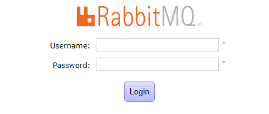

# Docker compose + RabbitMQ + Traefik

**Setup**
- Traefik 2
- RaabitMQ 3.5

*Into `.env` file you have vars for set your RabbitMQ*

---

```bash
$ git clone htts://this.repo
```

```bash
$ docker-compose up
```

Now you can go to RabbitMQ web admin, your user and password set on `.env` file:

```bash
RABBITMQ_USER
RABBITMQ_PASSWORD
```
http://192.168.56.101:5672


