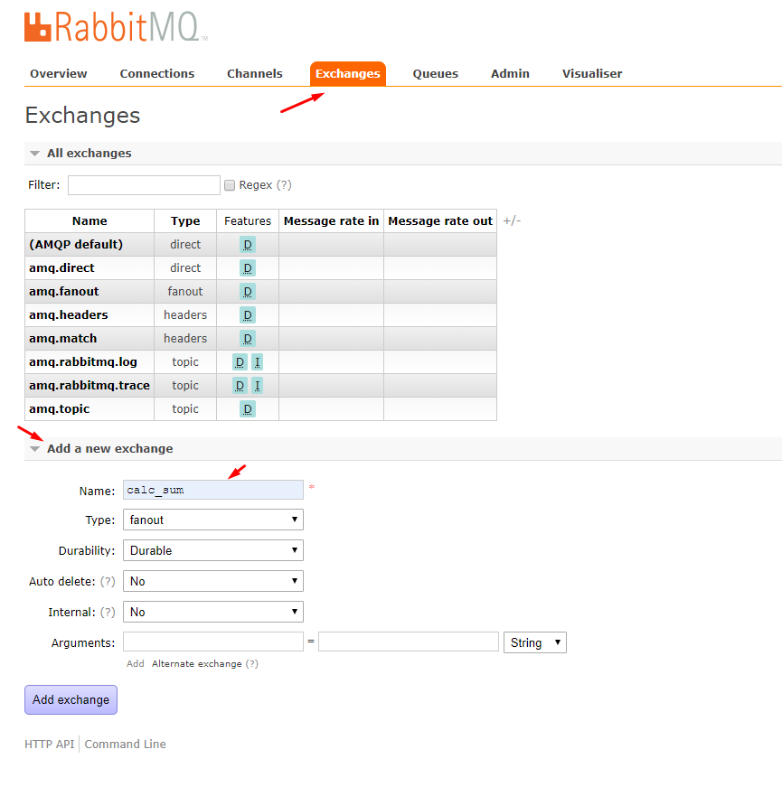

# Docker compose + RabbitMQ + Traefik

**Setup**
- Traefik 2
- RabbitMQ 3.5

*Into `.env` file you have vars for set your RabbitMQ*

---

```bash
$ git clone https://github.com/itsalb3rt/traefik-rabbitmq-docker-compose
```

```bash
$ docker-compose up
```

Now you can go to RabbitMQ web admin, your user and password set on `.env` file:

```bash
RABBITMQ_USER
RABBITMQ_PASSWORD
```
http://192.168.56.101:15672


now go to `Exchange` tab and and click on `Add a new exchange` for this example create one `calc_sum` and click on button `Publish message`



---

# UI Test App

Got to https://github.com/itsalb3rt/rabbitmq-reactapp-consumer-test and follow the instructions.

# Backend Test App (Node)

Go to https://github.com/itsalb3rt/rabbitmq-nodeapp-consumer-test and follow the instructions.
